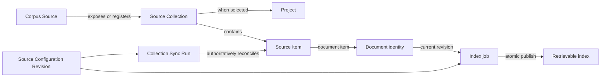

# Multi-Source Corpus Design

This document consolidates the accepted design for replacing ReasonKB's single local-or-SMB corpus with an unlimited runtime-managed set of local, SMB, and Seeyon V8.1SP2 sources. The individual trade-offs and rationale remain in `docs/adr/`; `CONTEXT.md` is the canonical domain glossary.

## Product Boundary

- A deployment may configure any number of Corpus Sources of different connector types at the same time.
- One source connection may expose many Source Collections. Each enabled collection creates exactly one isolated Project.
- Projects never merge across sources, even when names or content match. Conversations may select multiple Projects.
- Projects are shared retrieval scopes across the deployment. Only the deployment Source Administrator manages sources and destructive operations.
- Connectors are strictly read-only. ReasonKB does not upload, move, overwrite, delete, or change permissions in source systems.
- Manual Project creation and file upload are removed from the formal product.
- SQLite/WAL and a single-node deployment remain the supported architecture for this release.

The release has no fixed product cap, but must be verified with 100 enabled sources, 1,000 Projects, and 100,000 discovered documents.

## Domain Relationships

Identity is independent of display labels:

| Entity | Identity |
| --- | --- |
| Corpus Source | Internal immutable source ID |
| Source Collection | Connector identity scoped by source |
| Seeyon collection | `(source_id, docLibId, rootArchiveId)` |
| Project | Internal immutable Project ID, one per collection |
| Document | `(source_id, Source Item ID)` |
| Seeyon document | `fr_id`, normalized as an opaque string |
| Seeyon revision | `file_id + fr_size`, both normalized safely |
| Local/SMB fallback item | Source-relative path |

For local and SMB sources, top-level directories are collections. Supported files directly beneath the configured root form the synthetic `__root__` Root Collection. Renames become a missing old item and a new item when the connector lacks a stable native ID; content hashes never guess identity.

## Source Configuration

Sources are created and edited through the administration UI and persisted in SQLite. Changes take effect without restarting containers. Environment variables are limited to deployment bootstrap settings, including the allowed local mount root, master-key path, and service-wide defaults.

The Source Scope is immutable after creation:

- Local: root path beneath the pre-mounted Local Source Access Root.
- SMB: host, share, and base path.
- Seeyon: server endpoint.

Changing scope creates a new source. Display name, schedule, size limit, and credentials remain editable on the same source.

Every saved configuration change advances a Source Configuration Revision. Work created under an older revision may finish external I/O but cannot reconcile state or publish an index after a newer revision exists.

### Credentials

Source credentials are stored as authenticated ciphertext in SQLite. The encryption key exists on the host at `~/.reasonkb/secrets/master.key`, mode `600`, and is mounted read-only into the Web, source worker, and index worker at `/run/secrets/reasonkb_master_key`. It is not mounted into the retrieval API. Backups require both SQLite and the master key; a lost key requires credential re-entry.

Seeyon tokens are memory-only. A first business-request `401` triggers one single-flight reauthentication and retry. Repeated `401`, authentication failure, timeout, or ambiguous server errors degrade the source; only an explicit authorization denial after valid authentication, such as `403`, creates access-revoked state.

Changing only the password while Seeyon identity fields remain unchanged is credential rotation and does not remove current indexes from retrieval during validation. Changing `loginName` or REST username changes the Source Principal: all affected Projects leave retrieval until validation and an authoritative sync under the new principal succeed.

## Collection Registration And Selection

Local and SMB connectors discover collections. Seeyon cannot use server extensions, internal Ajax APIs, or direct database access, so administrators register libraries by display name, `docLibId`, and `rootArchiveId`, then validate them through the supported document-list API. A failed registration may be saved as a draft but cannot be selected.

Every new source begins with the `None` Collection Selection Policy:

| Policy | Meaning |
| --- | --- |
| `None` | No collections enabled |
| `Explicit` | Only the stored set is enabled |
| `All` | All current and future discovered or registered collections enabled |

Transitions are deterministic:

- `All -> Explicit` snapshots all currently known collections.
- `Explicit -> All` enables current and future collections.
- Any policy to `None` deactivates all Projects but retains data.
- `None -> Explicit` starts with an empty set.

For Seeyon, `All` means all currently and subsequently registered libraries; ReasonKB cannot include unregistered source-side libraries.

An enabled registration must be deselected before deregistration. Deregistration retains its identity, Project, documents, and indexes. Registering the same identity restores it; permanent cleanup is a separate purge operation.

## Synchronization Model

The connector boundary provides:

1. Connection validation.
2. Collection discovery or registration validation.
3. Bounded, paginated metadata scanning for one collection.
4. Revision-specific document fetching.

Connectors normalize metadata but do not write SQLite, create Projects, infer Missing state, or enqueue jobs. The connector-agnostic sync engine owns those operations.

Each enabled collection has independent persistent Sync Runs. Metadata pages are upserted in short transactions and tagged with `last_seen_run_id`. Only a complete successful run may mark previously known unseen items Missing. Interrupted traversal, pagination failure, unreadable folders, transport failure, or stale configuration makes the run non-authoritative.

One collection cannot run overlapping scans. A manual request during an active run creates one high-priority follow-up; repeated requests coalesce. A scheduled source operation fans out collection runs within global and per-source concurrency limits.

Default schedules are:

| Connector | Default | Minimum |
| --- | ---: | ---: |
| Local | 30 seconds | 5 seconds |
| SMB | 5 minutes | 30 seconds |
| Seeyon | 10 minutes | 60 seconds |

Manual-only mode is supported. A manual synchronization request also performs one Collection discovery pass, then clears its one-time due marker. Schedules include jitter; failures back off only the affected source.

## Lifecycle And Retrieval Safety

Enabling a collection immediately creates a Pending Project. The first successful authoritative metadata sync activates it, even while indexing continues. Retrieval Coverage reports retrievable, queued, indexing, refreshing, failed, unsupported, oversized, missing, and access-revoked counts.

Only the successfully indexed current Source Revision is retrievable. When a new revision is observed, the old index leaves retrieval immediately. The job fetches the expected revision and publishes with compare-and-swap only if the document, source configuration, selection, and lifecycle state are still eligible. Stale work becomes `Superseded` and does not consume retry budget.

Authorization failures apply to the smallest proven scope:

- Collection-root denial makes the Project Access Revoked.
- Document denial makes only that Source Item Access Revoked.
- An unreadable folder makes the run incomplete; its subtree is not inferred Missing.

Disabling a source, deselecting a collection, deregistering it, changing principal, or requesting deletion removes affected content from retrieval immediately. Queued work is cancelled; running work cannot publish after its eligibility fence changes.

## Indexing And Retention

Only regular supported documents are fetched. Folder metadata is retained for hierarchy and lazy browsing but never indexed. Symlinks, junctions, DFS links, and recognizable reparse points are not followed.

Unsupported and oversized documents retain identity and metadata without fetching. The default maximum is 100 MiB per document, configurable per source up to a hard 1 GiB maximum. Transfers stream to temporary disk and enforce actual as well as declared size.

Index priority is administrator work, revision refresh, first indexing, then retry, with fairness across sources and Projects. Global worker concurrency is the only hard claim limit; a source may use idle capacity while sources and Projects with fewer in-flight jobs remain preferred. Transient failures retry with jitter at approximately 1 minute, 5 minutes, 15 minutes, 1 hour, and 6 hours.

Retention rules:

- Superseded revision indexes are removed after successful replacement.
- Missing indexes are retained for 30 days by default.
- Inactive and access-revoked content is retained until explicit action.
- Source Tombstones are retained long-term.
- Source and Project purge default to a 7-day recoverable Pending Purge state.
- Immediate purge requires typing the Source or Project display name.
- Due immediate purges are checked every 5 seconds; long-term retention remains an hourly maintenance pass.
- Administration audit records are sanitized, append-only, and retained for 180 days by default.

## Services And Trust Boundaries

| Service | Responsibilities | Credentials or source access |
| --- | --- | --- |
| Web | Admin authentication, source CRUD, encryption, selection UI, health UI | Master key; no long-running scan |
| Source worker | Scheduling, discovery, validation, collection sync, reconciliation, job creation | Master key and required source mounts |
| Index worker | Fetch, conversion, indexing, retry, atomic publication | Master key and required source mounts |
| Retrieval API | Query only active current indexes | No master key, credentials, or source mount |
| Gotenberg | Office conversion | Temporary input only |

Source and index workers publish liveness heartbeats for Docker health checks. On source-worker startup, abandoned Running discovery and synchronization records are failed and their staged observations are discarded before new work is claimed. Every credential-bearing service validates that the mounted master key is a private regular file before startup.

Local source paths must remain within a pre-mounted read-only Local Source Access Root. Adding sources inside that boundary is runtime-only; expanding the host boundary requires changing the Docker mount and recreating containers.

## Administration Experience

The source list shows type, display name, enabled state, health, selection policy, Project coverage, last successful sync, consecutive failures, next retry, and a sanitized error summary. A first failed sync is Degraded; three consecutive failures become Needs Attention. Invalid configuration, invalid credentials, and definitive authorization failure become Needs Attention immediately. A complete successful sync restores normal health and resets the count.

The initial release provides no email, SMS, or vendor-specific chat notification. A future optional generic webhook can consume the same health model.

Project labels follow collection labels and are not independently editable. Same-named Projects always display their source type and Source Display Name in selectors, results, and citations.

One deployment administrator account protects all administration routes with a secure session cookie. Only a strong password hash is persisted. Ordinary retrieval remains behind the deployment or reverse-proxy boundary; general user management, per-user sources, and Project ACLs are outside this release.

## Migration

The migration is idempotent and runs before the new source worker starts:

1. Create the new source, collection, item, run, credential, audit, and lifecycle structures.
2. Convert the existing configured local or SMB corpus into one enabled runtime source with `All` policy.
3. Backfill collections and source item identities while preserving source-backed Project IDs, document IDs, indexes, jobs, and conversation references.
4. Permanently remove demo manual-upload Projects, documents, indexes, jobs, conversation links, and managed upload files.
5. Record completion and prevent the legacy directory watcher from running alongside the new worker.
6. Treat SQLite as authoritative afterward; legacy source environment values warn for one release but never overwrite runtime configuration.

Ambiguous source-backed records stop migration for administrator resolution rather than guessing identity.

## Explicitly Out Of Scope

- Source relocation when endpoint, share/base path, or local root changes.
- Automatic Seeyon document-library discovery.
- Seeyon subfolder-as-Project selection or subtree filters.
- Cross-source document or index deduplication.
- Multi-node SQLite sharing or horizontal ReasonKB replicas.
- Manual file upload or ReasonKB-managed source write-back.
- Per-user, department, or Project ACLs and general user management.
- External alert delivery in the initial release.
